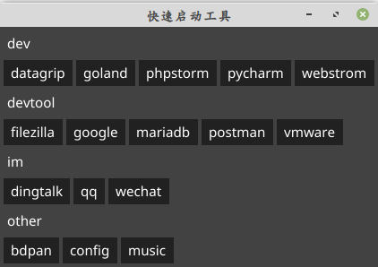

# app-gui
Linux上APP快速启动GUI工具
项目地址:https://github.com/aveyuan/app-gui
### 开发背景
>在Linux中，可执行的文件和脚本文件总是会打开一个终端，当终端关闭的时候，执行的文件也就关闭了。
你为此苦恼不已，然后你添加到桌面图标，尝试过添加到服务进行管理，用一些类似于Supervisor的管理软件，但得不偿失。你渴望找到一个以后台（daemon）运行的方式，
把各种复杂的脚本文件，二进制文件通通管理起来，不要占用我们的终端。

### APP-GUI诞生
>用最小化的配置得到最好的结果。APP-GUI作为一个便捷的启动，托管工具她已经做得足够好


### 应用截图

### 配置说明
>下面仅仅为示例，可根据内容自行扩展
```bash
titile=快速启动工具
[web]
baidu=xdg-open https://www.baidu.com
github=xdg-open http://www.github.com

```
- title为启动软件的标题
- [web]为一个菜单
- baidu为具体配置内容后面跟需要执行的命令


### 已知问题
- 配置的按钮为中文会乱码（暂时使用英文吧）
